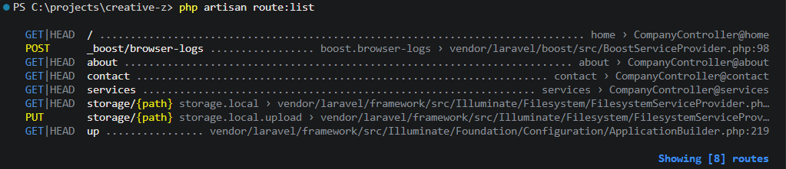
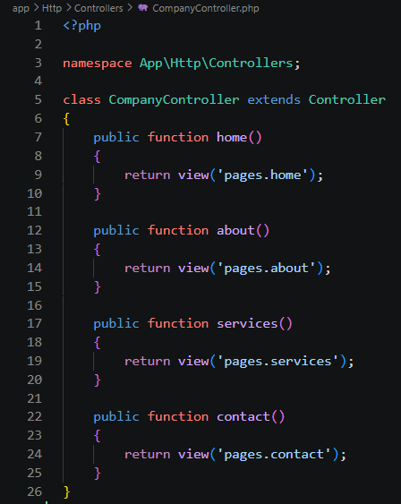
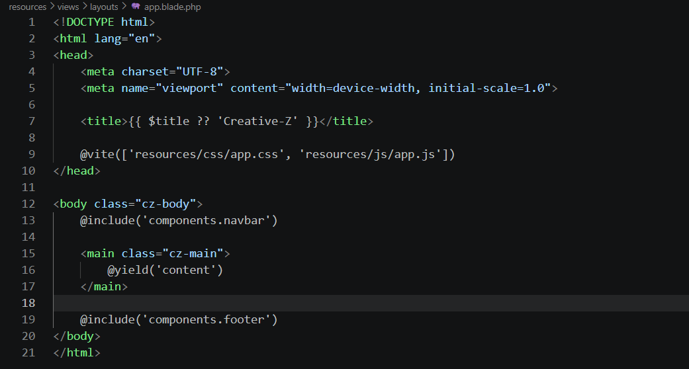
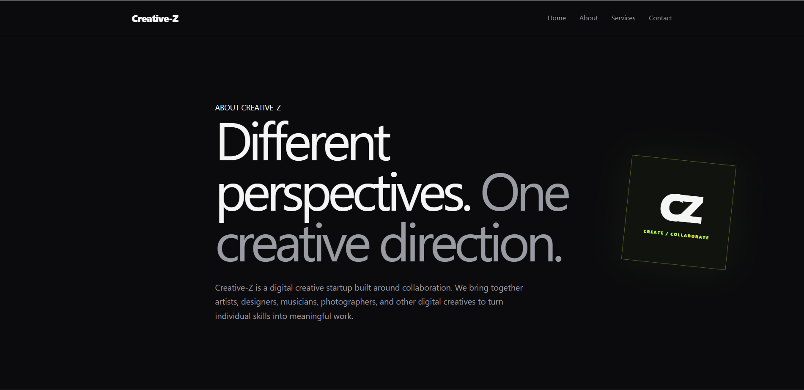
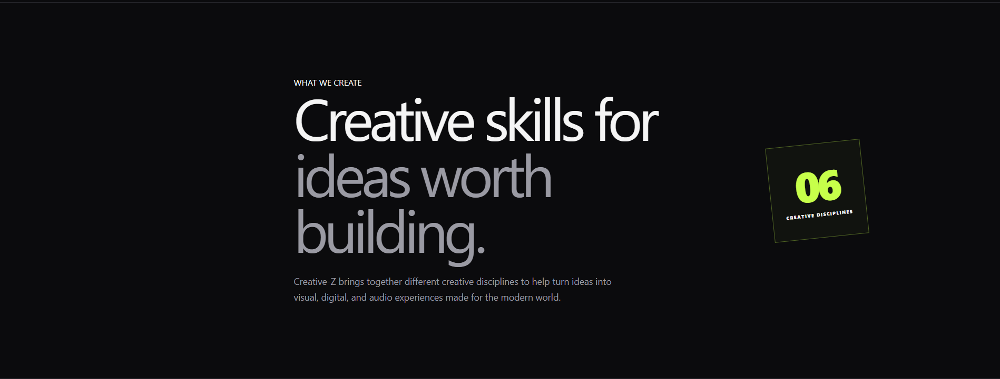
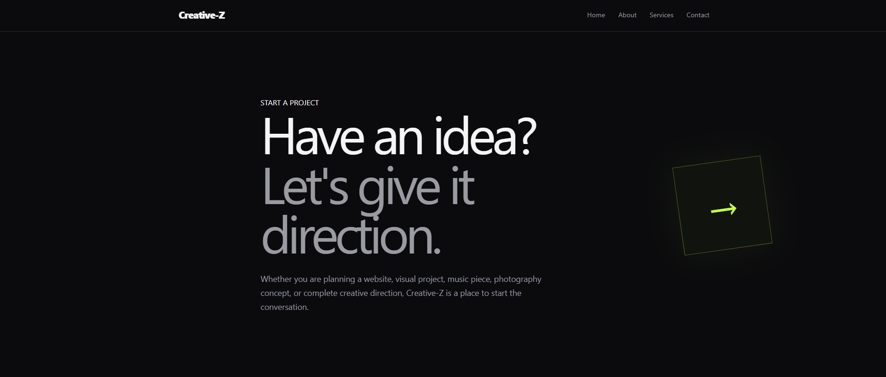
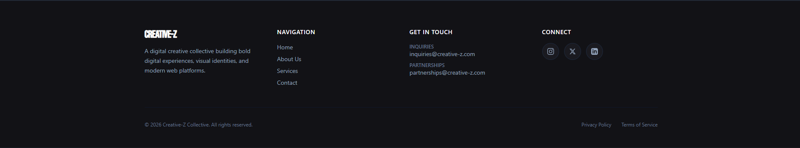

# Creative-Z Company Profile Website

## 1. Project Title

**Creative-Z Company Profile Website** — a multi-page Laravel application built to practice MVC architecture, routing, controllers, and Blade templating.

---

## 2. Introduction

### What is a Company Profile Website?

A company profile website presents important information about a company, organization, or business. It typically includes details about the company, its services, its goals, and its contact information — content that helps visitors quickly understand what the company offers.

### Why Businesses Need One

A company profile website gives a business a professional presence online. It lets potential clients learn about the company, explore its services, and find a way to reach out, at any time and without needing a direct introduction. It also helps establish credibility and communicate the company's identity clearly and consistently.

### Purpose of the Project

Creative-Z is a multi-page Company Profile Website built with Laravel. The site represents a fictional digital creative startup that brings together creative disciplines such as graphic design, web design, music, photography, video/motion, and branding.

The purpose of the project is to practice Laravel's MVC architecture, routing, controllers, Blade templating, reusable layouts, and reusable Blade components while building a functional, visually organized company profile website.

---

## 3. Objectives

This project accomplished the following objectives:

- Developed a multi-page Company Profile Website using Laravel.
- Implemented Laravel's Model-View-Controller (MVC) architecture.
- Created named routes for the main website pages.
- Built a `CompanyController` to handle page requests.
- Used Blade templates to organize website content.
- Implemented a reusable Blade layout.
- Created reusable navigation and footer components.
- Developed responsive pages for the Home, About, Services, and Contact sections.
- Practiced proper separation of concerns throughout the application.
- Documented the development process and project architecture.

---

## 4. MVC Architecture

### What is MVC?

MVC stands for Model-View-Controller. It's a software architecture pattern that separates an application into three responsibilities:

- **Model** — handles data and business logic.
- **View** — displays information to the user.
- **Controller** — handles incoming requests and decides what should happen before a response is returned.

This project focuses mainly on the Controller and View layers, since the website is currently static and doesn't require database-driven models.

### Why Laravel Uses MVC

Laravel uses MVC because it gives the application a clear, predictable structure. Instead of mixing routing logic, page logic, and HTML together in one place, Laravel separates them: the route decides which controller method handles a request, the controller decides which view to return, and the Blade view renders the actual page.

### Advantages of MVC

1. **Separation of concerns** — each part of the application has one clear responsibility.
2. **Better organization** — files are grouped by purpose, not mixed together.
3. **Maintainability** — one part of the app can change without breaking unrelated parts.
4. **Reusability** — components like the navbar and footer can be reused across every page.
5. **Scalability** — the structure holds up as the application grows.

### Request Flow Diagram

```text
Browser
   │
   ▼
Route
   │
   ▼
Controller
   │
   ▼
Blade View
   │
   ▼
Response to Browser
```

In this project specifically: a request hits `routes/web.php`, which forwards it to a method on `CompanyController`, which returns a Blade view from `resources/views/pages/`, which is rendered back to the browser as HTML.

---

## 5. Laravel Routing

### What is Routing?

Routing determines how an application responds when a user visits a specific URL. Each route defines a URL pattern, an HTTP method, and the action that should handle matching requests.

### GET Requests

Creative-Z uses GET routes for all four pages, since each one simply displays information to the visitor rather than submitting or modifying data.

### Named Routes

Routes are given names so Blade templates can reference them without hardcoding URLs. For example:

```php
Route::get('/about', [CompanyController::class, 'about'])->name('about');
```

This route is named `about`, so any Blade file can link to it with:

```blade
{{ route('about') }}
```

instead of writing the URL by hand — which matters if the URL path ever changes later.

### Route Definitions

The project's routes, defined in `routes/web.php`:

```php
use App\Http\Controllers\CompanyController;
use Illuminate\Support\Facades\Route;

Route::get('/', [CompanyController::class, 'home'])->name('home');
Route::get('/about', [CompanyController::class, 'about'])->name('about');
Route::get('/services', [CompanyController::class, 'services'])->name('services');
Route::get('/contact', [CompanyController::class, 'contact'])->name('contact');
```



---

## 6. Controllers

### Purpose of Controllers

Controllers handle incoming requests and connect routes to the correct views. Rather than placing page logic directly inside the route definitions, this project uses a dedicated `CompanyController`.

### Benefits of Controllers

- Keeps application logic organized in one place.
- Keeps route definitions short and readable.
- Separates routing concerns from page-handling concerns.
- Makes the codebase easier to maintain.
- Leaves room to add more functionality later without restructuring routes.

### Controller Methods

`app/Http/Controllers/CompanyController.php`:

```php
class CompanyController extends Controller
{
    public function home()
    {
        return view('pages.home');
    }

    public function about()
    {
        return view('pages.about');
    }

    public function services()
    {
        return view('pages.services');
    }

    public function contact()
    {
        return view('pages.contact');
    }
}
```

Each method returns the Blade view for its corresponding page. For example, `services()` returns `resources/views/pages/services.blade.php`.



---

## 7. Blade Templating Engine

Blade is Laravel's templating engine. It lets HTML and Laravel's template syntax live together cleanly, and this project uses Blade layouts, sections, and includes to avoid repeating code across pages.

### Blade Layouts

The main reusable layout lives at `resources/views/layouts/app.blade.php`. It defines the shared HTML structure — including the navigation bar, the main content area, and the footer — so individual pages don't need to redefine it.

### Blade Components

Reusable pieces of the interface, specifically the navbar and footer, are separated into their own files under `resources/views/components/` and pulled into the layout so the same markup isn't duplicated across every page.

### `@extends`

Each page extends the shared layout:

```blade
@extends('layouts.app')
```

### `@section`

Page-specific content is wrapped in a section:

```blade
@section('content')
    <!-- Page content -->
@endsection
```

### `@yield`

The layout marks where that page content should be inserted:

```blade
@yield('content')
```

### `@include`

The layout pulls in the reusable components:

```blade
@include('components.navbar')
@include('components.footer')
```

This means the navbar and footer only need to be written once and are shared across every page automatically.

### Example Layout

```blade
<!DOCTYPE html>
<html lang="en">
<head>
    <meta charset="UTF-8">
    <meta name="viewport" content="width=device-width, initial-scale=1.0">
    <title>{{ $title ?? 'Creative-Z' }}</title>
    @vite(['resources/css/app.css', 'resources/js/app.js'])
</head>
<body class="cz-body">
    @include('components.navbar')

    <main class="cz-main">
        @yield('content')
    </main>

    @include('components.footer')
</body>
</html>
```



---

## 8. Laravel Folder Structure

| Folder | Purpose |
|---|---|
| `app/` | Contains the application's core code, including `CompanyController.php` under `app/Http/Controllers/`. |
| `routes/` | Contains the application's route definitions, including `web.php`. |
| `resources/` | Contains frontend resources — Blade views (`resources/views/`), CSS (`resources/css/app.css`), and JS. |
| `public/` | Contains publicly accessible assets and the application's entry point. |
| `bootstrap/` | Contains files that bootstrap and initialize the Laravel application on each request. |
| `config/` | Contains configuration files for the different parts of the Laravel application. |

---

## 9. Screenshots

- Home Page
- About Page
- Services Page
- Contact Page
- Navigation Bar
- Footer
- Route Definitions
- Controller
- Blade Layout

### Home Page


### About Page


### Services Page


### Contact Page


### Navigation Bar


### Footer


### Route Definitions


### CompanyController


### Blade Layout


---

## 10. Problems Encountered

### Problem 1: Route Not Found

Routes were initially defined to return Blade views directly rather than going through a controller. Once the project required a controller-based structure, the routes needed to be rewritten to point to `CompanyController` methods instead.

### Problem 2: Controller Namespace / Setup Issues

The project didn't originally have a `CompanyController`. Since the requirements called for a controller with `home()`, `about()`, `services()`, and `contact()` methods, the controller had to be created, correctly namespaced, and wired up to the routes.

### Problem 3: Blade Layout and Component Duplication

Navigation and footer markup were initially duplicated across every page. This made even small changes tedious, since the same edit had to be repeated on every file.

---

## 11. Solutions

### Solution to Route Issues

Routes were connected directly to `CompanyController` methods so each URL is handled consistently:

```php
Route::get('/', [CompanyController::class, 'home'])->name('home');
Route::get('/about', [CompanyController::class, 'about'])->name('about');
Route::get('/services', [CompanyController::class, 'services'])->name('services');
Route::get('/contact', [CompanyController::class, 'contact'])->name('contact');
```

### Solution to Controller Issues

`CompanyController` was created with the four required methods, each returning its matching Blade view, and correctly placed under `app/Http/Controllers/` so Laravel could resolve it via routing.

### Solution to Blade Duplication

A shared layout was created at `resources/views/layouts/app.blade.php`, and the navbar and footer were split into their own components under `resources/views/components/`. Every page now extends the shared layout with `@extends('layouts.app')`, and the layout pulls in the shared components with `@include`, so the same markup only exists in one place.

---

## 12. Reflection

Developing the Creative-Z Company Profile Website changed how I think about building a web application. Before this project, it was easy to picture a webpage as one large file containing everything it needed — markup, logic, and content all mixed together. Working through Laravel's MVC architecture showed me why that approach breaks down as an application grows, and why separating responsibilities into routes, controllers, and views makes a codebase easier to reason about.

I learned that routes are responsible for identifying which URL a user is requesting and deciding where that request should go next. In this project, routes are defined in `web.php` and each one points to a specific method on `CompanyController`. The controller then decides which Blade view to return. For example, when a visitor goes to `/about`, the `about` route calls `CompanyController::about()`, which returns the `pages.about` view, and that view produces the HTML sent back to the browser. Seeing this full request cycle laid out step by step made the abstract idea of "MVC" feel concrete.

Separation of concerns turned out to be the most important concept in the whole project. Keeping responsibilities isolated means a change in one layer doesn't ripple unpredictably into another. The routes in this project don't contain any page content, the controller doesn't contain any HTML, and the Blade views don't contain any routing logic. Each file does one job. That made the project noticeably easier to debug — when something went wrong, I always knew which layer to check first.

Reusable Blade layouts and components reinforced the same lesson at a smaller scale. Instead of writing the navigation bar and footer separately on every page, I built them once as components and included them through a shared layout. If the navigation ever needs to change, it only needs to change in one file, not four. That's a small example of a much bigger idea: good structure isn't just about getting something to work, it's about making future changes cheap instead of expensive.

This same architecture scales up naturally to larger, enterprise-level systems. A real production application might have dozens of controllers, models, services, and views, plus real database operations behind them. MVC gives a team a shared, predictable place to put each kind of code, so the codebase doesn't collapse into one massive, unreadable file as it grows. It also lets multiple developers work on different layers — routing, business logic, presentation — at the same time with far less risk of stepping on each other's work.

Overall, this project gave me a much clearer picture of how a browser request actually becomes a rendered webpage in Laravel, and why the discipline of keeping routes, controllers, and views separate pays off — not just for making the site work today, but for keeping it maintainable, reusable, and easy to extend later.

---

## 13. References

Laravel. (n.d.). *Laravel documentation*. Retrieved August 15, 2026, from https://laravel.com/docs

Laravel. (n.d.). *Blade templates*. In *Laravel documentation*. Retrieved August 15, 2026, from https://laravel.com/docs/blade

Laravel. (n.d.). *Controllers*. In *Laravel documentation*. Retrieved August 15, 2026, from https://laravel.com/docs/controllers

Laravel. (n.d.). *Routing*. In *Laravel documentation*. Retrieved August 15, 2026, from https://laravel.com/docs/routing

PHP Documentation Group. (n.d.). *PHP manual*. Retrieved August 15, 2026, from https://www.php.net/docs.php

Mozilla Developer Network. (n.d.). *MDN Web Docs*. Retrieved August 15, 2026, from https://developer.mozilla.org/